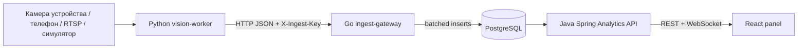

# AudienceFlow


AudienceFlow — распределённая система подсчёта посещаемости для аудиторий, лабораторий и учебных залов. Проект сделан как практическая инженерная работа: несколько сервисов, понятные границы ответственности, контейнерный запуск, роли пользователей, live-мониторинг и статический деплой операторской панели на GitHub Pages.

Сайт: https://fakedesyncc.github.io/AudienceFlow/

## Что умеет

- принимает события от камер и worker-ов через защищённый ingest endpoint;
- хранит измерения посещаемости в PostgreSQL;
- считает текущую загрузку, пики и 5-минутные агрегаты;
- показывает live-картину по корпусам, аудиториям и камерам;
- даёт отдельные рабочие разделы для преподавателей, техников и администраторов;
- позволяет техникам и админам подключать камеры через панель;
- выдаёт JWT после логина и не хранит рабочие пароли в репозитории;
- запускается локально через Docker Compose;
- автоматически проверяется через GitHub Actions.

## Роли

| Роль | Что видит | Что может делать |
| --- | --- | --- |
| Преподаватель | Заполненность аудиторий, графики, статусы камер без URL потоков | Смотреть текущую ситуацию и историю |
| Техник | Аудитории, камеры, источники потоков, статусы | Добавлять аудитории и камеры, готовить подключение RTSP/HTTP/device |
| Администратор | Всё, включая пользователей | Управлять пользователями, ролями и инфраструктурой |

## Интерфейс

Панель не хранит рабочие секреты и открывается в двух режимах:

- `Презентация` — обезличенный live-контур для быстрого показа интерфейса на GitHub Pages;
- `API` — подключение к реальному backend по введённому `API URL`, email и паролю.

После входа доступны отдельные разделы:

- `Оперативно` — центр мониторинга с фильтрами по корпусу и статусу, таблицей аудиторий, выбранной аудиторией, камерой и лентой событий;
- `Аналитика` — график 5-минутных агрегатов и карточки заполненности;
- `Аудитории` — реестр аудиторий и форма добавления для техника/администратора;
- `Камеры` — состояние источников и подключение RTSP/HTTP/device;
- `Доступ` — создание пользователей и ролей, только для администратора.

## Архитектура



Полиглотный стек выбран по назначению, а не ради таблицы в отчёте:

- Python — компьютерное зрение и интеграция с OpenCV/YOLO.
- Go — быстрый приём событий от worker-ов, backpressure и батчинг.
- Java/Spring Boot — бизнес-логика, безопасность, роли, REST и live-канал.
- TypeScript/React — операторская панель, формы, графики и GitHub Pages.
- PostgreSQL — временные ряды, индексы и агрегаты.

Подробнее: [docs/architecture.md](docs/architecture.md).

## Быстрый запуск

Сгенерировать локальные секреты и стартовые учётные записи:

```bash
./scripts/bootstrap-env.sh
```

Скрипт напечатает случайные email и пароли для администратора, техника и преподавателя. Эти данные не коммитятся и известны только тому, кто запускал скрипт.

Запустить систему:

```bash
docker compose up --build
```

Открыть:

- панель: http://localhost:3000
- Analytics API: http://localhost:8080/api/health
- ingest gateway: http://localhost:8081/healthz

На экране входа выбери `API`, укажи `http://localhost:8080/api` и введи сгенерированные email/пароль. Публичный режим `Презентация` не содержит логинов, паролей или токенов и нужен только для показа интерфейса без backend.

Проверить приём события:

```bash
make smoke
```

## Как показать преподавателю

1. Открой [публичную панель](https://fakedesyncc.github.io/AudienceFlow/) и нажми `Открыть мониторинг`, если нужно быстро показать интерфейс без backend.
2. Для реального стенда запусти `./scripts/bootstrap-env.sh`, затем `docker compose up --build`.
3. На экране входа выбери `API`, введи `http://localhost:8080/api` и одну из сгенерированных учётных записей.
4. Отправь событие через `make smoke` или запусти worker, чтобы live-центр обновился.

## Камера

Симулятор для демонстрации:

```bash
docker compose --profile worker up --build vision-worker
```

Камера ноутбука или подключённого устройства:

```bash
cd services/vision-worker
python3 -m venv .venv
source .venv/bin/activate
pip install -r requirements.txt
CAMERA_SOURCE=0 DETECTOR=hog ROOM_ID=1 GATEWAY_URL=http://localhost:8081/v1/events python -m app.main
```

Телефон обычно подключается через IP-camera приложение. Если приложение отдаёт RTSP или HTTP MJPEG, URL можно передать в `CAMERA_SOURCE` или добавить через раздел камер в панели.

YOLO включается отдельно:

```bash
pip install -r requirements-yolo.txt
DETECTOR=yolo YOLO_MODEL=yolov8n.pt python -m app.main
```

## Команды

```bash
make test      # Go, Java, Python syntax, React production build
make up        # docker compose up --build
make worker    # simulated worker profile
make smoke     # ручное событие в ingest gateway
make down      # остановить compose stack
```

## Безопасность

В репозитории нет рабочих паролей. Скрипт `scripts/bootstrap-env.sh` генерирует:

- пароль PostgreSQL;
- ingest API key для worker-ов;
- JWT secret;
- случайные email и стартовые пароли для администратора, техника и преподавателя.

Типовые слабые пары логин/пароль не используются. Если `.env` уже существует, скрипт не перезаписывает его без `FORCE=1`.

Frontend не содержит демонстрационных учётных записей. В API-режиме пользователь сам вводит `API URL`, email и пароль. JWT хранится в `sessionStorage`, а не в `localStorage`, поэтому сессия очищается после закрытия браузера.

## Деплой

GitHub Pages публикует только статическую панель. Backend остаётся контейнерным и запускается отдельно: локально, на VPS, на университетском сервере или в облаке.

Публичная Pages-версия открывает презентационный мониторинг без авторизации. Для реального стенда можно ввести API URL прямо на экране входа. Repository variable `VITE_API_URL` необязательна; она нужна только как предзаполненное значение:

```text
VITE_API_URL=https://your-api.example.com/api
```

Runbook: [docs/deployment.md](docs/deployment.md).

## Ветки и коммиты

`main` — deployable branch. Новая работа должна идти через ветки `feat/*`, `fix/*`, `docs/*` и PR. Первый bootstrap был отправлен напрямую в `main`, потому что репозиторий был пустой и нужно было поднять Pages. Дальше используется обычный branch workflow.

Правила: [CONTRIBUTING.md](CONTRIBUTING.md).
