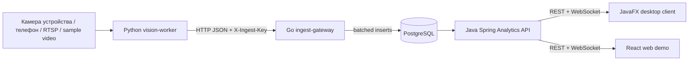

# AudienceFlow


AudienceFlow — распределённая система подсчёта посещаемости для аудиторий, лабораторий и учебных залов. Проект сделан как практическая инженерная работа: несколько сервисов, понятные границы ответственности, контейнерный запуск, роли пользователей, live-мониторинг и основной desktop-клиент для Windows, macOS и Linux.

Web demo: https://fakedesyncc.github.io/AudienceFlow/

## Что умеет

- принимает события от камер и worker-ов через защищённый ingest endpoint;
- хранит измерения посещаемости в PostgreSQL;
- считает текущую загрузку, пики и 5-минутные агрегаты;
- показывает live-картину по корпусам, аудиториям и камерам;
- даёт нативный JavaFX desktop-клиент для реального стенда;
- даёт mobile-first PWA companion для просмотра и проверки камеры устройства;
- даёт отдельные рабочие разделы для преподавателей, техников и администраторов;
- позволяет техникам и админам подключать камеры через панель;
- выдаёт JWT после логина и не хранит рабочие пароли в репозитории;
- запускается локально через Docker Compose;
- автоматически проверяется через GitHub Actions.

## Роли

| Роль | Что видит | Что может делать |
| --- | --- | --- |
| Преподаватель | Заполненность аудиторий, графики, статусы камер без URL потоков | Смотреть текущую ситуацию и историю |
| Техник | Аудитории, камеры, источники потоков, статусы | Добавлять аудитории и камеры, готовить подключение RTSP/HTTP/device |
| Администратор | Всё, включая пользователей | Управлять пользователями, ролями и инфраструктурой |

## Клиенты

Основной клиент — `services/desktop-client`. Это JavaFX-приложение для Windows, macOS и Linux: вход в API, оперативная таблица аудиторий, KPI, live WebSocket, fallback polling, отчёты с CSV-экспортом, разделы аудиторий, камер и пользователей.

Вкладка `Камера` подключается к preview-каналу vision-worker: показывает живой кадр с рамками детекции, текущий счёт людей, уверенность, FPS, умеет менять масштаб, сохранять снимки в `~/Pictures/AudienceFlow` и настраивать виртуальную линию для счёта входа/выхода.

Web-клиент — `services/web`. Это статическая демонстрация для GitHub Pages и mobile/PWA companion: можно открыть презентационный мониторинг, подключиться к реальному API, проверить камеру устройства в браузере и смотреть preview worker по MJPEG.

Ни desktop, ни web не хранят рабочие секреты. В web доступны два режима:

- `Презентация` — обезличенный live-контур для быстрого показа интерфейса на GitHub Pages;
- `API` — подключение к реальному backend по введённому `API URL`, email и паролю.

После входа доступны отдельные разделы:

- `Оперативно` — центр мониторинга с фильтрами по корпусу и статусу, таблицей аудиторий, выбранной аудиторией, камерой и лентой событий;
- `Отчёты` — выбор аудитории и периода, агрегаты посещаемости, экспорт CSV в `~/Documents/AudienceFlow`;
- `Аналитика` — график 5-минутных агрегатов и карточки заполненности в web demo;
- `Аудитории` — реестр аудиторий и форма добавления для техника/администратора;
- `Камеры` — состояние источников и подключение RTSP/HTTP/device;
- `Mobile` — PWA-экран для телефона/планшета: локальная проверка камеры, live-preview worker и подсказка по IP/MJPEG/RTSP подключению телефона;
- `Доступ` — создание пользователей и ролей, только для администратора.

## Архитектура



Полиглотный стек выбран по назначению, а не ради таблицы в отчёте:

- Python — компьютерное зрение и интеграция с OpenCV/YOLO.
- Go — быстрый приём событий от worker-ов, backpressure и батчинг.
- Java/Spring Boot — бизнес-логика, безопасность, роли, REST и live-канал.
- Java/JavaFX — основной desktop-клиент под Windows, macOS и Linux.
- TypeScript/React — демонстрационная web-панель и GitHub Pages.
- PostgreSQL — временные ряды, индексы и агрегаты.

Подробнее: [docs/architecture.md](docs/architecture.md).

## Быстрый запуск

Для демонстрации с реальными email запусти интерактивный first-run setup:

```bash
INTERACTIVE=1 ./scripts/bootstrap-env.sh
```

Скрипт спросит email администратора, техника и преподавателя. Пароль можно ввести вручную или оставить поле пустым, тогда будет сгенерирован стойкий пароль.

Для полностью автоматического локального стенда можно сгенерировать случайные локальные данные:

```bash
./scripts/bootstrap-env.sh
```

Эти данные не коммитятся, попадают только в локальный `.env` с правами `600` и известны только тому, кто запускал скрипт.

Запустить систему:

```bash
docker compose up --build
```

Открыть:

- web demo: http://localhost:3000
- Analytics API: http://localhost:8080/api/health
- ingest gateway: http://localhost:8081/healthz

Запустить основной desktop-клиент:

```bash
make desktop
```

На экране входа укажи `http://localhost:8080/api` и введи сгенерированные email/пароль. Публичный web-режим `Презентация` не содержит логинов, паролей или токенов и нужен только для показа интерфейса без backend.

Проверить приём события:

```bash
make smoke
```

## Как показать преподавателю

1. Для реального стенда запусти `INTERACTIVE=1 ./scripts/bootstrap-env.sh`, затем `docker compose up --build`.
2. Запусти desktop-клиент командой `make desktop`.
3. На экране входа введи `http://localhost:8080/api` и одну из сгенерированных учётных записей.
4. Отправь событие через `make smoke` или запусти worker, чтобы live-центр обновился.
5. Если нужно показать только внешний вид без backend, открой [web demo](https://fakedesyncc.github.io/AudienceFlow/).

## Камера

Публичное видео для демонстрации вместо синтетической камеры:

```bash
docker compose --profile worker up --build vision-worker
```

По умолчанию worker использует `CAMERA_SOURCE=sample` и публичный sample video. URL можно переопределить:

```bash
CAMERA_SOURCE=sample SAMPLE_VIDEO_URL=https://example.com/people.mp4 docker compose --profile worker up --build vision-worker
```

После запуска worker открой desktop-клиент, вкладку `Камера`, и укажи:

```text
Preview URL: http://localhost:8090
```

В блоке `Линия потока` можно применить координаты виртуальной линии, сбросить счётчики и увидеть `Вошло`, `Вышло`, `Баланс` и количество активных треков.

Камера ноутбука или подключённого устройства:

```bash
cd services/vision-worker
python3 -m venv .venv
source .venv/bin/activate
pip install -r requirements.txt
PREVIEW_ADDR=127.0.0.1:8090 CAMERA_SOURCE=device:0 DETECTOR=hog ROOM_ID=1 GATEWAY_URL=http://localhost:8081/v1/events python -m app.main
```

Телефон обычно подключается через IP-camera приложение. Если приложение отдаёт RTSP или HTTP MJPEG, URL можно передать в `CAMERA_SOURCE` или добавить через раздел камер в панели:

```bash
CAMERA_SOURCE=phone:http://192.168.1.10:8080/video DETECTOR=hog python -m app.main
CAMERA_SOURCE=rtsp://192.168.1.10/live DETECTOR=hog python -m app.main
```

На macOS Docker Desktop обычно не отдаёт встроенную камеру контейнеру, поэтому `device:0` лучше запускать worker-ом на host. На Linux можно пробросить `/dev/video*` в контейнер.

Если preview доступен не только с локальной машины, задай случайный токен:

```bash
PREVIEW_TOKEN=$(openssl rand -hex 24)
```

Тот же токен вводится во вкладке `Камера` desktop-клиента. В репозиторий токены не добавляются.

YOLO включается отдельно:

```bash
pip install -r requirements-yolo.txt
DETECTOR=yolo YOLO_MODEL=yolov8n.pt python -m app.main
```

Тестовое распознавание с готового фото или видео без камеры:

```bash
cd services/vision-worker
python -m app.main analyze ./samples/auditorium.jpg --detector hog --output ./samples/auditorium-annotated.jpg
python -m app.main analyze ./samples/lecture.mp4 --detector hog --frame-step 5 --max-frames 300 --output ./samples/lecture-annotated.mp4
```

Для лучшего качества на реальных аудиториях используй `--detector yolo` после установки `requirements-yolo.txt`. JSON выводится в stdout, а при `--json-output report.json` сохраняется отдельным файлом.

## Команды

```bash
make test      # Go, Java API, JavaFX client, Python syntax, React build
make desktop   # запуск JavaFX desktop-клиента
make desktop-image # runtime-образ desktop-клиента для текущей ОС
make up        # docker compose up --build
make worker    # sample-video worker profile
make smoke     # ручное событие в ingest gateway
make down      # остановить compose stack
```

## Безопасность

В репозитории нет рабочих паролей. Скрипт `scripts/bootstrap-env.sh` генерирует:

- пароль PostgreSQL;
- ingest API key для worker-ов;
- JWT secret;
- случайные email и стартовые пароли для администратора, техника и преподавателя.

Типовые слабые пары логин/пароль не используются. Если `.env` уже существует, скрипт не перезаписывает его без `FORCE=1`.

Для первого показа используй `INTERACTIVE=1 ./scripts/bootstrap-env.sh`: email вводятся вручную, а пароль можно задать самому или сгенерировать. Backend отклоняет дефолтный логин `admin`, распространённые пароли, пароли короче 14 символов и пароли, содержащие локальную часть email.

Клиенты не содержат демонстрационных учётных записей. Пользователь сам вводит `API URL`, email и пароль. Desktop-клиент не сохраняет пароль после отправки формы входа. В web JWT хранится в `sessionStorage`, а не в `localStorage`, поэтому сессия очищается после закрытия браузера.

## Деплой

GitHub Pages публикует только статическую web-демонстрацию. Backend остаётся контейнерным и запускается отдельно: локально, на VPS, на университетском сервере или в облаке. Desktop-клиенты собираются отдельным workflow `Build Desktop Clients`.

Публичная Pages-версия открывает презентационный мониторинг без авторизации. Для реального стенда можно ввести API URL прямо на экране входа. Repository variable `VITE_API_URL` необязательна; она нужна только как предзаполненное значение:

```text
VITE_API_URL=https://your-api.example.com/api
```

Runbook: [docs/deployment.md](docs/deployment.md).

## Ветки и коммиты

`main` — deployable branch. Новая работа должна идти через ветки `feat/*`, `fix/*`, `docs/*` и PR. Первый bootstrap был отправлен напрямую в `main`, потому что репозиторий был пустой и нужно было поднять Pages. Дальше используется обычный branch workflow.

Правила: [CONTRIBUTING.md](CONTRIBUTING.md).
