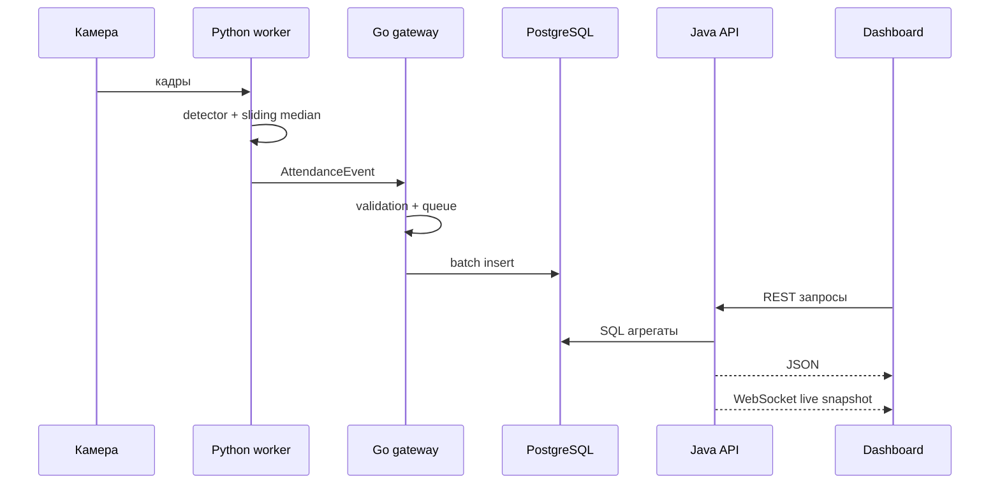

# Архитектура AudienceFlow

AudienceFlow считает посещаемость не «внутри одного большого приложения», а через цепочку небольших сервисов. Так проще объяснять систему на защите и проще менять отдельные части: камеру, способ детекции, API или frontend.

## Сервисы

| Сервис | Язык | Ответственность |
| --- | --- | --- |
| `vision-worker` | Python | Получает кадры, считает людей, стабилизирует значение, отправляет событие |
| `ingest-gateway` | Go | Принимает события от worker-ов, проверяет ingest key, держит очередь, пишет батчами |
| `analytics-api` | Java / Spring Boot | Авторизация, роли, аудитории, камеры, пользователи, агрегаты, live WebSocket |
| `web` | TypeScript / React | Dashboard для преподавателей, техников и администраторов |
| `postgres` | PostgreSQL | Хранение комнат, камер, пользователей, измерений и агрегатов |

## Поток данных



Событие worker-а:

```json
{
  "room_id": 1,
  "ts": "2026-07-01T10:32:15Z",
  "count": 47,
  "confidence": 0.83,
  "worker_id": "cam-aud-305"
}
```

## Почему так

Python остаётся рядом с OpenCV и YOLO. Go принимает много коротких I/O-запросов и не держит тяжёлой бизнес-логики. Java API отвечает за правила доступа и агрегаты, потому что это стабильный слой приложения. React отделён от backend и может быть опубликован как статический сайт.

Такой разрез делает проект удобным для практики: каждый сервис можно показать отдельно, но вместе они дают цельный поток «камера → событие → база → аналитика → панель».

## База данных

Основные таблицы:

- `rooms` — аудитории и вместимость;
- `cameras` — источники камер и их статус;
- `app_users` — пользователи и роли;
- `attendance` — сырые измерения;
- `audit_log` — место для последующего аудита действий;
- `attendance_5min` — view с 5-минутными агрегатами.

PostgreSQL выбран из-за нормальной работы со временем, индексов и оконных/агрегатных запросов. Если на стенде PostgreSQL не получится поднять, ближайший практичный fallback — перейти на SQLite для одиночного demo-режима или на MySQL/MariaDB для контейнерного режима. В таком случае придётся адаптировать SQL-тип `TIMESTAMPTZ`, view и driver-ы в Go/Java.

## Live-обновления

`analytics-api` отдаёт текущую картину через REST endpoint и WebSocket:

- REST нужен для первичной загрузки и fallback polling;
- WebSocket нужен для живой панели без постоянных ручных обновлений.

WebSocket принимает JWT в query-параметре. Это не идеальная схема для публичного production, но для учебного MVP она проста и понятна. Для промышленного режима лучше перейти на короткоживущие socket tokens или cookie-based auth.

## Границы MVP

Проект уже работает как демонстрационный distributed MVP. Что стоит делать дальше:

- добавить полноценный трекинг входа/выхода через виртуальную линию;
- вынести миграции в Flyway или Liquibase;
- добавить audit events для действий администратора;
- прикрутить refresh tokens;
- вынести backend на публичный хостинг и подключить Pages-панель к реальному API.
