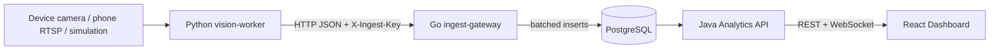

# AudienceFlow Architecture

AudienceFlow is a distributed attendance-counting system built as a practice-ready polyglot project:

- Python vision worker reads a camera, stabilizes a person count, and sends attendance events.
- Go ingest gateway validates worker events and writes them to PostgreSQL with bounded backpressure.
- Java Spring Boot Analytics API owns authentication, role-based access, room/camera administration, aggregates, and live updates.
- React/TypeScript dashboard provides role-specific views for teachers, technicians, and administrators.
- PostgreSQL stores rooms, cameras, users, raw attendance events, audit records, and 5-minute aggregate views.

The repository also contains a protobuf contract for a future gRPC transport. The MVP uses HTTP JSON because it is faster to operate and easier to demonstrate during practice defense.
