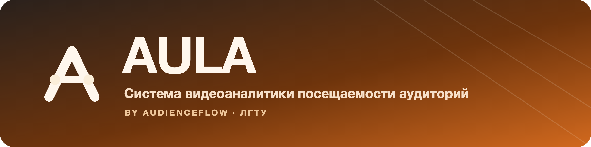

# Релиз AULA 1.0.0

**Система видеоаналитики посещаемости аудиторий · by AudienceFlow**
Дата: 2026-07-01

> AULA — продукт; AudienceFlow — платформа и техническое имя (пакеты, репозиторий,
> каталоги). Технические идентификаторы в этом релизе не менялись.

Первый релиз под именем **AULA**: единый визуальный язык, целостный бренд,
переработанные клиенты и доступность уровня WCAG AA. Функциональное ядро —
распределённый контур «камера → событие → база → аналитика → панель» — осталось
прежним; релиз делает продукт цельным и premium-выглядящим.

## Главное

- **Новое имя и знак.** Видимый продукт — AULA, с тихой подписью *by AudienceFlow*.
  Знак — A-монограмма с «линией учёта» и узлами-датчиками на концах (вход/выход).
- **Дизайн-язык «Warm Signal».** Тёплый янтарь как единственный акцент, эспрессо
  для инженерной основы, холодный слейт-тил для данных — много воздуха, мягкие
  тени, спокойный премиальный тон.
- **Единый контракт токенов** для веб-консоли и desktop-клиента:
  [design-system.md](design-system.md).
- **Доступность WCAG AA** по умолчанию.

## Что изменилось по поверхностям

### Веб-консоль (`services/web`)
Полный редизайн под янтарную палитру: карточки и панели на тёплых поверхностях,
метрики с мягким тинтом акцента, таблицы с аккуратными hairline-границами,
pill-бейджи состояний (норма/нагрузка/переполнение/сервис), обновлённая
навигация и осмысленные пустые/ошибочные состояния. Обновлён комплект иконок и
PWA-манифест (иконки 192/512 и maskable, `theme-color` `#D2691E`).

### Desktop-клиент (`services/desktop-client`)
JavaFX-клиент гармонизирован с тем же набором токенов, типографикой и тёплыми
тенями: оперативная таблица, KPI, вкладки камеры и отчётов выглядят как одна
система с веб-консолью. Добавлена иконка окна приложения.

### Бренд и иконки
Единый набор: `favicon.svg`, `aula-mark.svg` / `aula-mark-inverse.svg`,
`aula-icon.svg` и maskable-вариант, PNG-растры и баннер продукта.

## Дизайн-система

Визуальный язык зафиксирован как контракт в [design-system.md](design-system.md):
палитра, типографика (Inter, tabular-nums для метрик), шаг сетки 4px, радиусы,
тёплые тени, правила компонентов и раздел доступности. Цвета берутся только из
канонической таблицы — без хардкода мимо токенов.

## Доступность

- Контраст текста уровня **WCAG AA**.
- Видимый фокус клавиатуры (`--ring`) на всех интерактивных элементах.
- Поддержка `prefers-reduced-motion`.
- Смысл состояний дублируется текстом и иконкой, а не только цветом.

## Как запустить и показать

```bash
INTERACTIVE=1 ./scripts/bootstrap-env.sh   # реальные email + стойкие пароли
docker compose up --build                  # backend + web
make desktop                               # основной JavaFX-клиент
```

На экране входа укажите `http://localhost:8080/api` и одну из сгенерированных
учётных записей. Для показа только интерфейса без backend откройте
[web demo](https://fakedesyncc.github.io/AudienceFlow/) в режиме «Презентация».
Подробности — в [README](../README.md) и [deployment.md](deployment.md).

## Заметка об обновлении

Релиз локальный и визуальный: **миграций базы данных нет**, контракт API и формат
событий посещаемости не менялись. Обновление сводится к пересборке клиентов и
веб-консоли.

Полный список изменений — в [CHANGELOG.md](../CHANGELOG.md).
